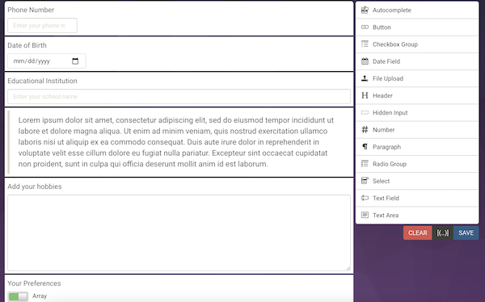
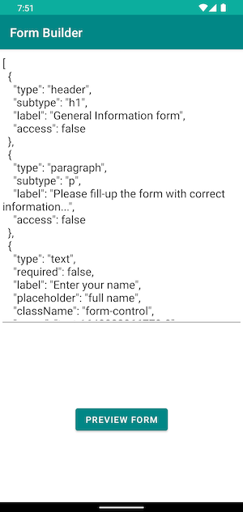
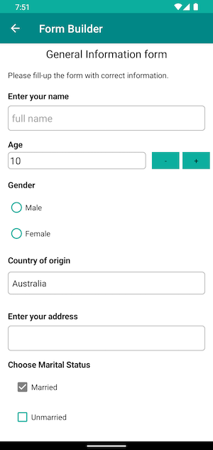
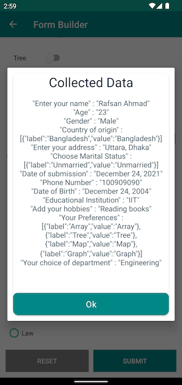

# Dynamic UI from JSON

## Functionality
The app's functionality includes:
1. The app generates Dynamic UI from JSON. The app support json, generated from https://formbuilder.online/

2. If the json is valid, the app will generate a preview of the form.

3. Supported widgets: `HEADER, TEXTVIEW, TEXTAREA, SELECT/SPINNER, RADIO-GROUP, PARAGRAPH, DATE, CHECKBOX-GROUP, NUMBER-FIELD, SWITCH-FIELD`.

4. User can submit or reset the form. After submit the data collected will be displayed using `JSONArray` properties.

## Building

You can open the project in Android studio and press run.
Android Studio version used to build the project: Arctic fox 2020.3.1

Gradle plugin used in the project will require `Java 11.0` to run.

you can set the gradle jdk in `Preferences->Build Tools->Gradle->Gradle JDK`

## Screenshots

Json for the Form             |  Form generation                   |   Data collect after submit
:------------------------:|:------------------------:|:------------------------
    |    |   

